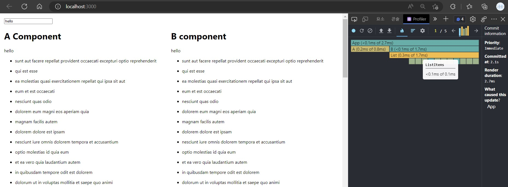
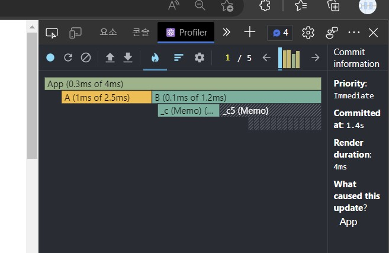

# 🌟react-Profiler-app

---

## :bell: Visit the site

➡️[Visit the Site!(Vercel)](https://react-tictactoe-app.vercel.app/)

➡️[Visit the Site!(Github pages)](https://0112shpark.github.io/react-tictactoe-app/)

## 🧐 About

Use react-profiler to compare the performance of components.  
After that, try to optimize it.

## 💡Features

-

## ⛏️Built with

- 
- 
- 
- 
- 

## 🏃Getting Started

### 📌 Start at local device

- This project works on the device with `node.js` installesd.

1. Make new folder on your computer.
2. Clone this repository.

- `git clone https://github.com/0112shpark/react-profiler-app.git`

3. Install npm packages.**(on your terminal.)**

- `npm install`

4. Run development server with following command.**(on your terminal.)**

- `npm start`

## 📚Some Analysis

### 📃Comparing A.js and B.js

---

#### `A.js` has all of the elements in one component.

```javascript
import React from "react";

//all elements in one component
const A = ({ message, posts }) => {
  return (
    <div>
      <h1>A Component</h1>
      <p>{message}</p>
      <ul>
        {posts.map((post) => {
          return (
            <li key={post.id}>
              <p>{post.title}</p>
            </li>
          );
        })}
      </ul>
    </div>
  );
};

export default A;
```

#### `B.js` devides elements in several componenets.

```javascript
import React from "react";

const Message = ({ message }) => {
  return <p>{message}</p>;
};

const ListItems = ({ post }) => {
  return (
    <li key={post.id}>
      <p>{post.title}</p>
    </li>
  );
};
const List = ({ posts }) => {
  return (
    <ul>
      {posts.map((post) => {
        return <ListItems key={post.id} post={post} />;
      })}
    </ul>
  );
};
const B = ({ message, posts }) => {
  return (
    <div>
      <h1>B component</h1>
      <Message message={message} />
      <List posts={posts} />
    </div>
  );
};

export default B;
```

✏️ If we look at the result at `profiler`, we can see that the `B.js` takes more time to render than the `A.js`.

<div align="center">

</div>

<br/>

- This is because `React` rerenders all the `child components` when its `parents component` renders. So, the `B component` will render when `App.js` renders. And all the its child components, such as `List, Message..etc` will render. However, `A.js`, just have one component, so it will render only once after `App.js` renders.
- But, to benefit the reusage and optimization of each components.

#### ⭐ we can use `react.memo()`.

---

#### `B.js` with `React.memo()`.

```javascript
import React from "react";

const Message = React.memo(({ message }) => {
  return <p>{message}</p>;
});

const ListItems = React.memo(({ post }) => {
  return (
    <li key={post.id}>
      <p>{post.title}</p>
    </li>
  );
});
const List = React.memo(({ posts }) => {
  return (
    <ul>
      {posts.map((post) => {
        return <ListItems key={post.id} post={post} />;
      })}
    </ul>
  );
});
const B = ({ message, posts }) => {
  return (
    <div>
      <h1>B component</h1>
      <Message message={message} />
      <List posts={posts} />
    </div>
  );
};

export default B;
```

- React first render the component, and compare it with previous results and update `DOM`.
- By using `react.memo()`, React will `Memoizing` the component after it has been rendered. When next render occurs, if the `props` of the component are same, React will reuse the Memoized component.

- By the result, `B.js` takes less time than `A.js` when rendering the component.
<div align="center">

</div>
